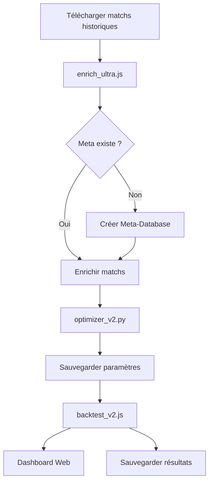

# 🚀 DRC - Deep Research Classifier

Système de prédiction de matchs de football utilisant le modèle SDM (Statistical Deep Mining) avec détection des Impact Players.

## 📁 Structure du Projet

```
DRC/
├── data/                       # Toutes les données du projet
│   ├── meta/                  # Meta-données (Top Players, Squads)
│   │   └── league_XX_meta.json
│   ├── history/               # Historiques de matchs
│   │   └── history_XX.json
│   ├── elo/                   # Historiques ELO
│   │   └── elo_history_archive.json
│   ├── params/                # Paramètres optimisés
│   │   └── optimized_params.json
│   ├── results/               # Résultats de backtests
│   │   └── backtest_YYYY-MM-DD.json
│   └── backups/               # Sauvegardes automatiques
│
├── scripts/                    # Scripts organisés par fonction
│   ├── enrichment/            # Scripts d'enrichissement
│   │   └── enrich_ultra.js
│   ├── backtest/              # Scripts de backtest
│   │   └── backtest_v2.js
│   ├── optimization/          # Scripts d'optimisation
│   │   └── optimizer_v2.py
│   └── utils/                 # Utilitaires
│       ├── debug.js
│       ├── debug.py
│       └── check_elo.py
│
├── logs/                      # Logs d'exécution
├── archive/                   # Anciens projets
├── node_modules/              # Dépendances Node.js
├── package.json               # Configuration Node.js
├── .gitignore                 # Fichiers à ignorer par Git
└── README.md                  # Ce fichier
```

## 🔧 Installation

### Prérequis
- Node.js >= 14.x
- Python >= 3.8
- npm ou yarn

### Dépendances Node.js
```bash
npm install axios
```

### Dépendances Python
```bash
pip install numpy scipy optuna
```

## 🚀 Utilisation

### 1. Réorganiser le Projet (Première Fois)

Si vous avez un ancien projet à migrer :

```bash
# Rendre le script exécutable
chmod +x reorganize_project.sh

# Lancer la réorganisation
./reorganize_project.sh
```

### 2. Enrichissement des Données

**Phase 1 : Construction de la Meta-Database** (1 fois par mois)
```bash
cd scripts/enrichment
node enrich_ultra.js
```

Cette phase récupère :
- Top 20 Scorers par ligue
- Top 20 Assists par ligue
- Squads complets de chaque équipe

**Phase 2 : Enrichissement des Matchs** (après chaque journée)

Le même script enrichit automatiquement tous les matchs avec :
- Statistics (xG, tirs, passes, possession)
- Injuries (blessures et absences)
- Events (timeline des buts, cartons)
- Lineups (compositions d'équipe)
- Players (ratings individuels)

### 3. Optimisation des Paramètres

```bash
cd scripts/optimization
python optimizer_v2.py
```

Le script trouve les meilleurs paramètres en minimisant le **Brier Score** :
- Split chronologique 80/20 (Train/Test)
- 150 trials d'optimisation
- Intégration des Impact Players
- Bayesian Shrinkage pour début de saison

**Résultat** : `data/params/optimized_params.json`

### 4. Backtest

```bash
cd scripts/backtest
node backtest_v2.js
```

Le backtest génère :
- Dashboard web sur `http://localhost:3000`
- Fichier de résultats dans `data/results/`
- Métriques : SDM, Score Exact, BTTS, Over/Under 2.5

## 📊 Métriques Clés

### Brier Score
- **Formule** : `moyenne((proba_prédite - résultat_réel)²)`
- **Interprétation** :
  - `< 0.20` : Excellent modèle
  - `0.20 - 0.25` : Bon modèle
  - `> 0.25` : Modèle faible

### Précision SDM (Simple Double Marge)
- Pari sur `1X` (Home gagne ou nul) ou `X2` (Away gagne ou nul)
- Objectif : `> 70%` de précision

### Impact Players
- **Offensive** : Malus si Top Scorer/Assist absent
- **Defensive** : Bonus si DC adverse de rating > 7.0 absent

## 🎯 Paramètres du Modèle

| Paramètre | Description | Plage Typique |
|-----------|-------------|---------------|
| `w_xg` | Poids des Expected Goals | 0.4 - 2.5 |
| `w_elo` | Poids du système ELO | 0.1 - 2.5 |
| `rho` | Correction Dixon-Coles | -0.15 - 0.25 |
| `hfa` | Home Field Advantage | 15 - 150 points ELO |
| `impact_offensive` | Malus absence attaquants | 0.05 - 0.30 |
| `impact_defensive` | Bonus absence défenseurs | 0.05 - 0.25 |
| `min_matches` | Seuil minimal de matchs | 3 (fixe) |

## 🔄 Workflow Complet



## 📝 Fichiers Importants

### `data/meta/league_XX_meta.json`
Contient les Top Players et Squads de chaque ligue.

**Structure** :
```json
{
  "league_id": "39",
  "season": 2025,
  "top_scorers": [...],
  "top_assists": [...],
  "squads": {
    "team_id": {
      "name": "Manchester City",
      "players": [...]
    }
  }
}
```

### `data/history/history_XX.json`
Historique enrichi de tous les matchs d'une ligue.

**Structure** :
```json
[
  {
    "fixture": {...},
    "teams": {...},
    "goals": {...},
    "stats": {...},
    "enriched": true,
    "raw_data": {
      "statistics": [...],
      "injuries": [...],
      "events": [...],
      "lineups": [...],
      "players": [...]
    },
    "context": {
      "injuries_home": [...],
      "injuries_away": [...],
      "lineup_home": [...],
      "lineup_away": [...],
      "player_ratings_home": [...],
      "player_ratings_away": [...],
      "goals_timeline": [...]
    }
  }
]
```

### `data/params/optimized_params.json`
Paramètres optimisés par `optimizer_v2.py`.

**Structure** :
```json
{
  "timestamp": "2025-01-15T10:30:00",
  "best_params": {
    "w_xg": 0.7245,
    "w_elo": 1.6832,
    "rho": -0.0623,
    "hfa": 42.1567,
    "impact_offensive": 0.1834,
    "impact_defensive": 0.1123
  },
  "train_brier": 0.1876,
  "test_brier": 0.1923,
  "n_trials": 150
}
```

## 🐛 Débogage

### Logs Manquants
```bash
# Créer le dossier logs
mkdir -p logs

# Rediriger la sortie
node backtest_v2.js > logs/backtest_$(date +%Y%m%d_%H%M%S).log 2>&1
```

### Vérifier les Données ELO
```bash
cd scripts/utils
python check_elo.py
```

### Vérifier l'Enrichissement
```bash
cd scripts/utils
node debug.js
```

## 📚 Ressources

- **API Football** : https://www.api-football.com/documentation-v3
- **Dixon-Coles Model** : [Article de recherche](https://www.researchgate.net/publication/238068381_Modelling_Association_Football_Scores_and_Inefficiencies_in_the_Football_Betting_Market)
- **Club ELO** : http://clubelo.com/

## 🔐 Sécurité

**IMPORTANT** : Ne jamais commiter votre clé API !

```bash
# Dans .gitignore
*.env
config/api_keys.json
```

## 📄 Licence

Projet privé - Tous droits réservés

## 👤 Auteur

DRC Project - Deep Research Classifier

---

**Dernière mise à jour** : 25 Décembre 2024